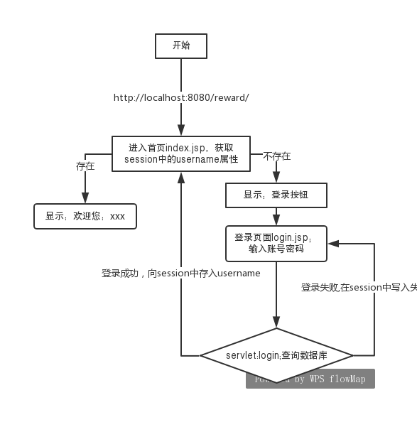
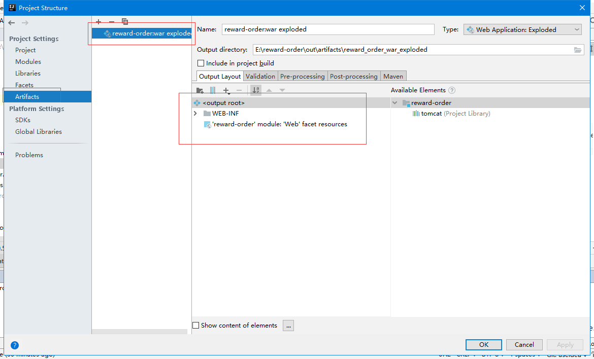
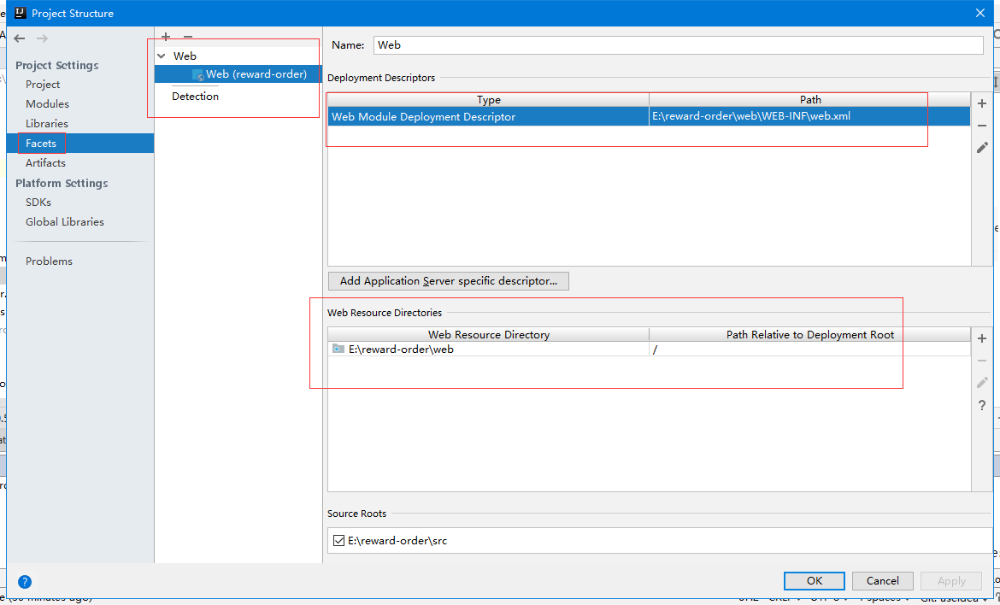
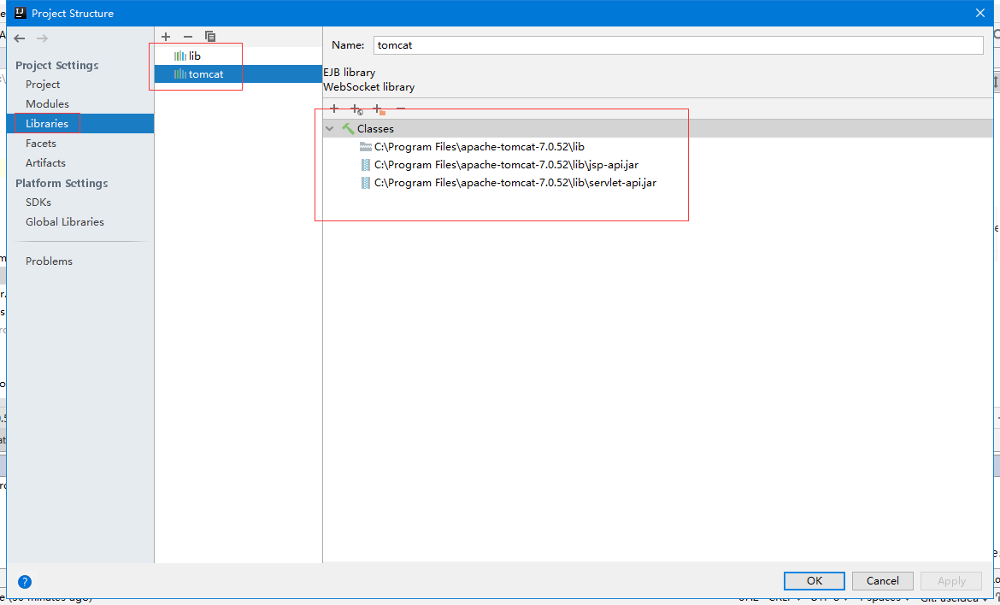
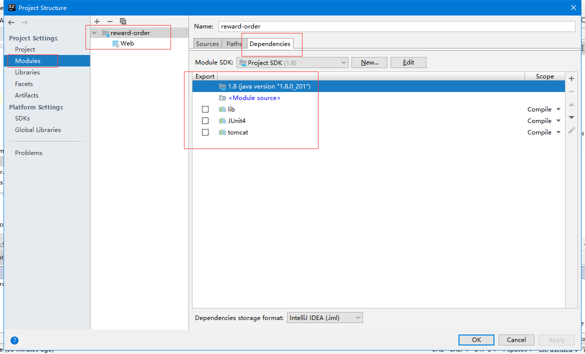

# 文档说明

该项目实现了用户登录；用户个人的悬赏发布、查看、修改、删除；

## 1.1自动登录

### 1.1.1实现功能


 
 
### 练习内容

1. 数据库连接池`C3P0`
2. `DBUtiles`,对CRUD封装,原生JDBC返回`ResultSet`,需要自定义转换方案；使用DBUtiles可以很容易地得到实体类对象
3. 使用Filter实现自动登录，同时使用到了cookie和session

## BUG

### 问题1：

新引入了`c3p0-0.9.1.2.jar`和`commons-dbutils-1.4.jar`
这两个包；如果是在java应用程序中，不会有任何问题。
但是在java web程序中会报错


```
严重: ContainerBase.addChild: start: 
org.apache.catalina.LifecycleException: Failed to start component [StandardEngine[Catalina].StandardHost[localhost].StandardContext[/reward]]

Caused by: java.lang.NoClassDefFoundError: org/apache/commons/dbutils/ResultSetHandler

```

解决方案:将用到的`c3p0-0.9.1.2.jar``lib/commons-dbutils-1.4.jar`两个包都放到了Tomcat的lib文件下
可能是因为这两个包需要和`mysql-connector-java-5.1.7-bin.jar`放到一起

### 问题2
 解决了问题1 的BUG 然后又出现另外一个问题
```
信息: Initializing c3p0 pool... com.mchange.v2.c3p0.ComboPooledDataSource [ acquireIncrement -> 3, acquireRetryAttempts -> 30, acquireRetryDelay -> 1000, autoCommitOnClose -> false, automaticTestTable -> null, breakAfterAcquireFailure -> false, checkoutTimeout -> 0, connectionCustomizerClassName -> null, connectionTesterClassName -> com.mchange.v2.c3p0.impl.DefaultConnectionTester, dataSourceName -> 1hge0yua11moifbq5f536r|d714de5, debugUnreturnedConnectionStackTraces -> false, description -> null, driverClass -> null, factoryClassLocation -> null, forceIgnoreUnresolvedTransactions -> false, identityToken -> 1hge0yua11moifbq5f536r|d714de5, idleConnectionTestPeriod -> 0, initialPoolSize -> 3, jdbcUrl -> null, maxAdministrativeTaskTime -> 0, maxConnectionAge -> 0, maxIdleTime -> 0, maxIdleTimeExcessConnections -> 0, maxPoolSize -> 15, maxStatements -> 0, maxStatementsPerConnection -> 0, minPoolSize -> 3, numHelperThreads -> 3, numThreadsAwaitingCheckoutDefaultUser -> 0, preferredTestQuery -> null, properties -> {}, propertyCycle -> 0, testConnectionOnCheckin -> false, testConnectionOnCheckout -> false, unreturnedConnectionTimeout -> 0, usesTraditionalReflectiveProxies -> false ]


警告: com.mchange.v2.resourcepool.BasicResourcePool$AcquireTask@7ab19cee -- Acquisition Attempt Failed!!! Clearing pending acquires. While trying to acquire a needed new resource, we failed to succeed more than the maximum number of allowed acquisition attempts (30). Last acquisition attempt exception: 
java.sql.SQLException: No suitable driver
```

通过`信息`可以看出来是没有使用c3p0-config.xml文件；这在java应用程序中是没有问题的；

...

经过一系列的尝试，(包括将`c3p0-0.9.1.2.jar`被放到`C:\Program Files\Java\jdk1.8.0_201\jre\lib\ext`的文件夹中)最后引发了问题,然后将mysql的jar放进去，移除都没有响应，在java应用程序中也不能正常运行了

```
java.lang.ClassNotFoundException: com.mysql.jdbc.Driver
```

然后将`c3p0-0.9.1.2.jar`从java的lib中移除，保证了在java程序中的正常运行

最后用eclipse运行了该项目，没有出现问题

再次重新部署到idea中，将依赖包加入项目的方式可能做了修改，然后就成功运行了
 
 ## lib配置
 
 这个是网上讲的另一种在idea中创建web项目的方式，可以参考其中的配置lib的方式
 
 http://www.cnblogs.com/shindo/p/7272646.html
 
 放几张配置Libraries的图：
 
 
 
 
 
 
 
 