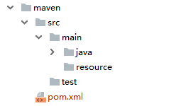

# 1. maven安装

- 要求当前系统以及配置了JAVA_HOME的环境变量，即java相关
- maven下载咯，http://maven.apache.org/download.cgi， 下载.zip解压到无空格、无中文目录下
- 配置maven的环境变量：M2_HOME maven的根目录(更新版本时只需要修改该环境变量即可)；path 中添加maven的bin目录
- `mnv -v` 查看版本，验证是否配置成功

## 1.2 maven 的第一个项目

maven 的目录结构要按照约定来哦;当然空目录可以不创建



### 1.2.1 clean

清理已经编译的内容，直接删除target文件

### 1.2.2 ompile

编译主程序，会在根目录下生成 target文件

>异常：`http://cwiki.apache.org/confluence/display/MAVEN/MojoFailureException`
>需要注意，此时的错误，很有可能是因为 java代码编写有问题导致的

### 1.2.3 test-compile

编译测试程序

### 1.2.4 package

将项目打包成.jar文件放到target目录下

### 1.2.5 install

打包生成.jar或者.war，并且存放到仓库中

### 1.2.6 deploy

将最终的包发送到远程仓库，可以共享咯

## 1.3 仓库

默认仓库位置`C:\Users\Administrator.SC-201902181839\.m2\repository`

在setting.xml文件中可以修改

```xml
<localRepository>D:\myMavenRepository</localRepository>
```

## 1.4 idea配置maven


---
参考

https://www.javazhiyin.com/36512.html

https://www.javazhiyin.com/19409.html

https://www.javazhiyin.com/5070.html

# 2. springboot

2.0新特性

- 支持语言：Kotlin
- 底层框架：Spring Framwork 5.0x
- 全新特性：Web Flux
    - 函数编程：Java8 Lambda
    - 响应编程：Reactive Streams
    - 异步编程：Servlet 3.1 或 Async NIO  


---
参考

https://www.javazhiyin.com/33614.html

https://www.javazhiyin.com/18537.html
