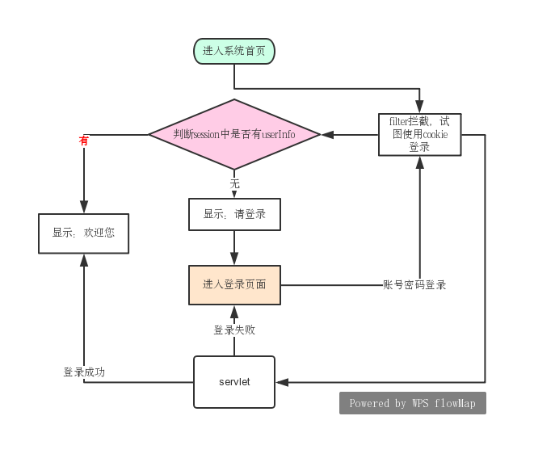

文档说明

该项目使用了C3P0连接数据库,可以创建连接池

使用DBUtiles来处理CRUD，只需将C3P0创建的ComboPooledDataSource (实现DataSourse接口)

实现了自动登录功能

```
QueryRunner qr = new QueryRunner(new ComboPooledDataSource());
```


# 1 自动登录

## 1.1 实现功能


 
 
 autoLogin filter说明：
 
- 在登录页面可以选择自动登录的CheckBox
- autoLogin Filter的自动登录功能，只在进入首页时有效
- 检查session是否存在，确认其是否登录
- 若未登录再判断cookie中是否有autoLogin属性
- 然后用autoLogin中的账号密码尝试登录
- 登录成功则设置用户信息的session
- 登录成功与否都会进入相应的页面

login servlet说明：

- 根据账号密码查询数据库，确认是否登录成功
- 成功后将userInfo存入session，否则返回登录页
- 如果选择自动登录，那么将账号密码存到cookie中（明文存储，有安全问题）


其它filter说明：
- 另外需要新增一个 Filter的功能，拦截请求
- 进入与个人相关的页面时，需要先判断session，确定其是否登录
- 未登录，则先跳转到 登录页面
- 已登录，才可以进入相应页面
 
## 1.2 练习内容

1. 数据库连接池`C3P0`
2. `DBUtiles`,对CRUD封装,原生JDBC返回`ResultSet`,需要自定义转换方案；使用DBUtiles可以很容易地得到实体类对象
3. 使用Filter实现自动登录，同时使用到了cookie和session
4. cookie.setPath("/login");限制的方法使用场景需了解；

>cookie是由服务器命令浏览器创建，并且保存在浏览器中的。
浏览器创建cookie以后访问url的时候，会决定是否带cookie，因为以下方式设置了匹配url的规则：
cookie默认的路径是产生cookie的路径`/reward`，可以在当前应用程序中共享，因为当前应用的路径都是在`/reward`下；
设置`cookie.setPath("/")`可以使cookie在同一应用服务器中共享；
设置`cookie.setPath("/other")`则只能在同一个服务器下的other应用中共享；
跨域共享`cookie.setDomain(".xxx.com")`必须以`.`开头
设置`cookie.setPath("/reward/index.jsp");`，可以在url为`http://localhost:8080/reward/register.jsp`带上cookie,不能只设置`/register.jsp`

```
Cookie cookie = new Cookie("autoLogin", userInfo.getUserid() + "#" + userInfo.getPassword());
cookie.setMaxAge(60 * 60 * 24 * 7);
cookie.setPath("/reward/index.jsp");
resp.addCookie(cookie);
```


## 1.3 BUG

### 1.3.1 问题1：

`java.lang.ClassNotFoundException: com.mysql.jdbc.Driver`
 在java程序中，直接导入连接mysql的jar包即可； 但是在java web项目中，需要将mysql的jar放到Tomcat的包lib文件夹下，否则找不到
 
 放置到tomcat中确实解决了问题，但是放在lib中以正确的方式添加到项目中即可；
 
 说明是将第三方包添加到项目的方式有问题


### 1.3.2 问题2：

新引入了`c3p0-0.9.1.2.jar`和`commons-dbutils-1.4.jar`
这两个包；如果是在java应用程序中，不会有任何问题。
但是在java web程序中会报错


```
严重: ContainerBase.addChild: start: 
org.apache.catalina.LifecycleException: Failed to start component [StandardEngine[Catalina].StandardHost[localhost].StandardContext[/reward]]

Caused by: java.lang.NoClassDefFoundError: org/apache/commons/dbutils/ResultSetHandler

```

解决方案:将用到的`c3p0-0.9.1.2.jar``lib/commons-dbutils-1.4.jar`两个包都放到了Tomcat的lib文件下
可能是因为这两个包需要和`mysql-connector-java-5.1.7-bin.jar`放到一起

### 1.3.3 问题3：
 解决了问题1 的BUG 然后又出现另外一个问题
```
信息: Initializing c3p0 pool... com.mchange.v2.c3p0.ComboPooledDataSource [ acquireIncrement -> 3, acquireRetryAttempts -> 30, acquireRetryDelay -> 1000, autoCommitOnClose -> false, automaticTestTable -> null, breakAfterAcquireFailure -> false, checkoutTimeout -> 0, connectionCustomizerClassName -> null, connectionTesterClassName -> com.mchange.v2.c3p0.impl.DefaultConnectionTester, dataSourceName -> 1hge0yua11moifbq5f536r|d714de5, debugUnreturnedConnectionStackTraces -> false, description -> null, driverClass -> null, factoryClassLocation -> null, forceIgnoreUnresolvedTransactions -> false, identityToken -> 1hge0yua11moifbq5f536r|d714de5, idleConnectionTestPeriod -> 0, initialPoolSize -> 3, jdbcUrl -> null, maxAdministrativeTaskTime -> 0, maxConnectionAge -> 0, maxIdleTime -> 0, maxIdleTimeExcessConnections -> 0, maxPoolSize -> 15, maxStatements -> 0, maxStatementsPerConnection -> 0, minPoolSize -> 3, numHelperThreads -> 3, numThreadsAwaitingCheckoutDefaultUser -> 0, preferredTestQuery -> null, properties -> {}, propertyCycle -> 0, testConnectionOnCheckin -> false, testConnectionOnCheckout -> false, unreturnedConnectionTimeout -> 0, usesTraditionalReflectiveProxies -> false ]


警告: com.mchange.v2.resourcepool.BasicResourcePool$AcquireTask@7ab19cee -- Acquisition Attempt Failed!!! Clearing pending acquires. While trying to acquire a needed new resource, we failed to succeed more than the maximum number of allowed acquisition attempts (30). Last acquisition attempt exception: 
java.sql.SQLException: No suitable driver
```

通过`信息`可以看出来是没有使用c3p0-config.xml文件；这在java应用程序中是没有问题的；

...

经过一系列的尝试，(包括将`c3p0-0.9.1.2.jar`被放到`C:\Program Files\Java\jdk1.8.0_201\jre\lib\ext`的文件夹中)最后引发了问题,然后将mysql的jar放进去，移除都没有响应，在java应用程序中也不能正常运行了

```
java.lang.ClassNotFoundException: com.mysql.jdbc.Driver
```

然后将`c3p0-0.9.1.2.jar`从java的lib中移除，保证了在java程序中的正常运行

最后用eclipse运行了该项目，没有出现问题

再次重新部署到idea中，将依赖包加入项目的方式可能做了修改，然后就成功运行了

结论：第三方jar包加入项目中的方式要正确
 
## 1.4 lib配置
 
 这个是网上讲的另一种在idea中创建web项目的方式，可以参考其中的配置lib的方式
 
 http://www.cnblogs.com/shindo/p/7272646.html
 
 放几张配置Libraries的图：
 
 
 
 
 
 
 
 

# 2 mybatis的使用

参考文件
- [笔记01](resource/mybatis/Mybatis_day01笔记.docx)
- [笔记02](resource/mybatis/Mybatis_day02笔记.docx)

## 2.1 环境配置 

 使用mybatis实现悬赏模块的增删改查

1. 下载mybatis包：
 https://github.com/mybatis/mybatis-3/releases
2. 将以下jar添加到项目中
    - `mybatis-3.2.7.jar`mybatis的核心包;
    - `lib文件夹下所有jar`mybatis的依赖包所在，也需要添加
3. 创建实体类`mybatis.bean.RewardOrder`
4. 创建sql映射文件，书写sql:`mybatis/bean/RewardOrder.xml`
5. 创建config文件夹，添加配置文件
    - mybatis默认使用log4j输出日志信息，配置文件为`log4j.properties`
    - `config/SqlMapConfig.xml`,配置数据源和事务管理
6. 使用:`mybatis.test.MyBatisTest.java`


